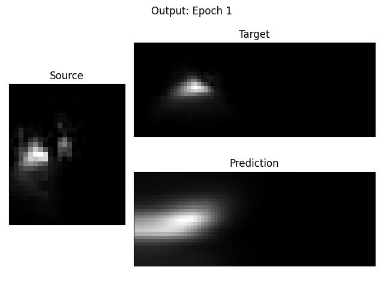
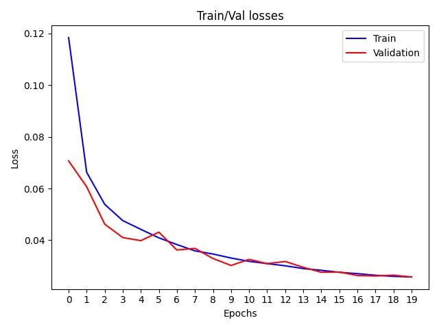

<h1 align="center">Fully Convolutional Autoencoder for Wave Spectra Prediction</h1>

---

<p align="center">
   
   
   
   
</p>

---

WaveSpectra is a 55-layer Fully Convolutional Neural Network (FCNN) designed to perform unsupervised image-to-image regression on offshore wave energy density spectrograms. Once trained, the network is capable of accurately predicting corresponding near shore wave conditions from offshore data. 

<p align="center">
   
</p>

> If running on Colab or similar, follow the included **get_data** and **Walkthrough** notebooks

## Usage:
### **Download repository & install requirements**
   ```python
    git clone https://github.com/Dedini91/WaveSpectra.git
    pip install -r requirements.txt
   ```

Example usage:
```python
python make_balanced_dataset.py -d path/to/data_folder -n new_dataset_test -c 50 --split 80 20 10
```
```python
python train.py -n exp_name --verbose --cache -d path/to/folder/containing/npz_files -b 1 -e 30 --lr 0.00001 --track 05902 --outputs --device cuda
python train.py -n resume_exp --verbose --cache -d path/to/folder/containing/npz_files --model_path path/to/model/last.pth --track 05902 --outputs --device cuda --resume
```
```python
python evaluate.py --model_path path/to/best_model.pth -d path/to/folder/containing/npz_files --verbose --device cuda
```
```python
python predict.py -d data/x_test.npz --model_path path/to/best_model.pth
```

For each script, there are only a few required arguments. 

> Execute `script_name.py --help` to print the complete list of supported arguments.

---

## 1. **Preprocess raw data and make dataset**
> Use "get_data.ipynb" to retrieve and save raw data in compressed .npz format

* **make_balanced_dataset.py**
   * Perform PCA, and Constrained KMeans
   * Sample clusters equally to partition data into train/validation/test sets
 
```python
# Required arguments:           Type-Default        Description
    -d      --data              str-None            'path to directory containing .npz files'
    -n      --name              str-None            'dataset name'
    -s      --split             str-None            'number of train/val/test samples per cluster. e.g. --split 50 20 10"'
    -c      --clusters          str-None            'number of clusters (classes)'
```

---

## 2. **Training**
* **train.py**
   * Training and validation of neural network
   * Basic evaluation on test data
   * Runs are timestamped; all outputs are saved to ***results/exp_name/datetime/***

* The model will default to using gpu where available, unless `--device cpu` is passed.

```python
# Required arguments:           Type-Default        Description
    -d      --data              str-None            'path to directory containing .npz files'
    -n      --name              str-None            'experiment name'
```
* Each run is logged to ***./results/exp_name/datetime/***
* Best & most recent model checkpoints saved to ***./results/exp_name/datetime/model/***
* Train/Validation predictions saved to ***./results/exp_name/datetime/predictions/*** if argument ```--outputs``` is passed
* ```--track``` can be passed with a training sample ID to view prediction from each epoch
* Training supports storing data in RAM for rapid retrieval using ```--cache```

#### **Logging with tensorboard**
* Metrics are automatically logged to ***./results/exp_name/datetime/logs/***
* View in tensorboard by running the following in a separate terminal:
```python
tensorboard --logdir="path/to/logs_folder/"
```

<p align="center">
   
</p>

---

## 3. **Evaluation**
* **evaluate.py**
   * Performs evaluation on any dataset with corresponding ground truths

```python
# Required arguments:           Type-Default        Description
            --model_path        str-None            'path to checkpoint'
    -d      --data              str-None            'path to directory containing .npz files'
```
Raw results are logged, and also saved in .csv format

---

## 4. **Inference**
* **predict.py**
   1. Perform inference on images using a trained model

```python
# Required arguments:           Type-Default        Description
            --model_path        str-None            'path to checkpoint'
    -d      --data_path         str-None            'path to directory containing .npz files'
```

---

# TODO

* Add support for:
   * Entering custom image sizes
