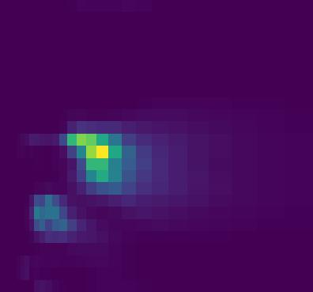
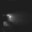
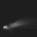
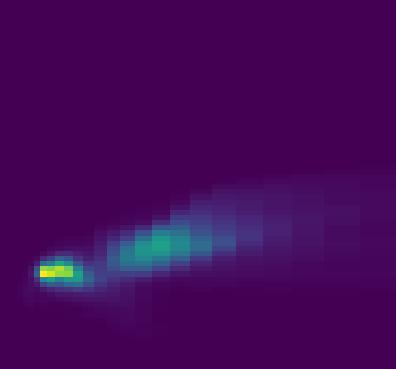
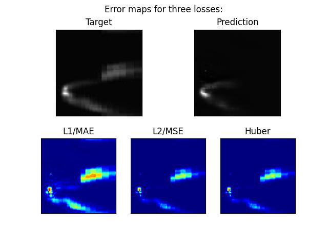

<h1 align="center">Convolutional Autoencoder for Wave Spectra Prediction</h1>

---

<p align="center">
   
   
   
   
</p>

---

This is a Pytorch implementation of an unsupervised image to image convolutional autoencoder, capable of accurately predicting near shore wave spectra from corresponding offshore spectra in the form of 64*64 spectrograms.

Normalised offshore (source) and near shore (target) spectra are passed through a 55-layer network, which returns an image via a sigmoid activation in the final layer.

As the output tensor's dimensions match those of the input, the raw weights of the terminal layer can be treated as pixel activations.

> If running on Colab or similar, follow the included .ipynb walkthrough notebook

## Usage:
### **Download the repository & install requirements**
   ```python
    git clone https://github.com/Dedini91/WaveSpectra_CAE.git
    pip install -r requirements.txt
   ```

Arguments are passed when running the script from the command line.

Example usage:
```python
python make_balanced_dataset.py --data path/to/data_folder -n new_dataset_test
```
```python
python train.py -n exp_name -d "data/processed/" -b 1 -e 10 -o adamw -l ssim --lr 0.00005 --verbose
```
```python
python evaluate.py --model_path "path/to/best_model.pth" --img_path "./path/to/image_folder" --target_path "./path/to/targets_folder" --verbose
```
```python
python predict.py --model_path "path/to/best_model.pth" --img_path "./path/to/image_folder"
```

For each script, there are only a few required arguments. 

> Executing `script_name.py --help` will print the complete list of supported arguments.

---

## 1. **Preprocess raw data and make dataset**
* **make_balanced_dataset.py**
   1. Extract spectrogram pairs from .NETCDF files, store in ***data/raw/***
   2. Basic preprocessing (resize to 64*64, rename, greyscale), store in ***data/interim/***
   3. Reduce dimensions using PCA, and perform KMeans clustering on embeddings
   4. Create train/validation/test split, taking equal # samples from each cluster, store in ***data/processed/***
   5. Calculate mean & std. dev. of training data
   
> Use "get_data.ipynb" to retrieve data and save spectrograms

Run the preprocessing script to obtain the following directory tree **(ensure .NETCDF files are in the correct location before executing):**

```
├── data/
│   ├── balanced/*.jpg
│   ├── raw/*.jpg
│   ├── interim/*.jpg
│   └── processed/
│       ├── x_train/*.jpg           # Training data:
│       │   ├── 00000.jpg           
│       │   ├── 00001.jpg
│       │   ├──    ...
│       │   └── 0000n.jpg
│       ├── y_train/*
│       ├── x_val/*                 # Validation data:
│       ├── y_val/*                 
│       ├── x_test/*                # Test/evaluation data:
│       ├── y_test/*                
│       └── red_.../*               # Prototyping folders (red_x_train... etc.)
├── train.py
├── evaluate.py
├── README.md
├── requirements.txt
├── raw_data.NETCDF
│   ...
└──
```
  * For prototyping purposes, manually create copies of [x_..., y_...] subfolders with the desired # samples, prepending "red_" to the directory name
    * e.g. ***red_x_train/***, ***red_y_train/***, etc. 

```python
# Required arguments:           Type-Default        Description
    -d      --data              str-None            'path to parent directory of raw data folder'
    -n      --name              str-None            'dataset name'
```

---

## 2. **Training**
* **train.py**
   1. Training and validation of neural network
   2. Basic evaluation on test data
   3. Runs are timestamped; all outputs are saved to ***results/exp_name/datetime/***

* The model will default to using gpu where available, unless the `--device cpu` argument is explicitly passed.

```python
# Required arguments:           Type-Default        Description
    -d      --data              str-None            'path to processed dataset'
    -n      --name              str-None            'experiment name'
```
* Each run is logged to ***./results/exp_name/datetime/***
* Model & optimiser saved to ***./results/exp_name/datetime/model/***
* Train/Validation predictions saved to ***./results/exp_name/datetime/predictions/***

#### **Logging with tensorboard**
* Basic metrics are automatically logged to ***./results/exp_name/datetime/logs/***
* View in tensorboard by running the following in a separate terminal:
```python
tensorboard --logdir="path/to/logs_folder/"
```

---

## 3. **Evaluation**
* **evaluate.py**
   1. Performs more in-depth evaluation on any dataset with corresponding ground truths
   2. Generates error maps to identify difficult examples
   3. Creates evaluation folder within parent run directory

Evaluates the performance of a trained model on previously unseen data (test set), giving an idea of how well it generalises.
* Pass source images located in `--img_path "./path/to/image_folder"` and paired target images `--target_path "./path/to/targets_folder"` to evaluate model located at `--model_path "./results/exp_name/datetime/model/best_model.pth"`.

```python
# Required arguments:           Type-Default        Description
            --model_path        str-None            'path to model and optimiser state_dict.pth files'
            --img_path          str-None            'path to folder/image for evaluation and inference'
            --target_path       str-None            'path to target images for evaluation and inference'
```
Numerical results are saved in .csv format ordered by lowest error (for the selected loss function). These can be loaded into Excel or Python for inspection.

Evaluation produces single and comparison images for each sample in the test set, with error maps turned on by default. Error maps display the per-pixel absolute error as calculated by various loss functions. Turning error maps off by passing `--errmaps` may improve training times. 

<p align="center">
   
</p>

---

## 4. **Inference**
* **predict.py**
   1. Perform inference on images using a trained model

```python
# Required arguments:           Type-Default        Description
            --model_path        str-None            'path to model and optimiser state_dict.pth files'
            --img_path          str-None            'path to folder/image for evaluation and inference'
```

---

# TODO

* Add support for:
   * Entering custom image sizes
   * Resuming training from checkpoint
